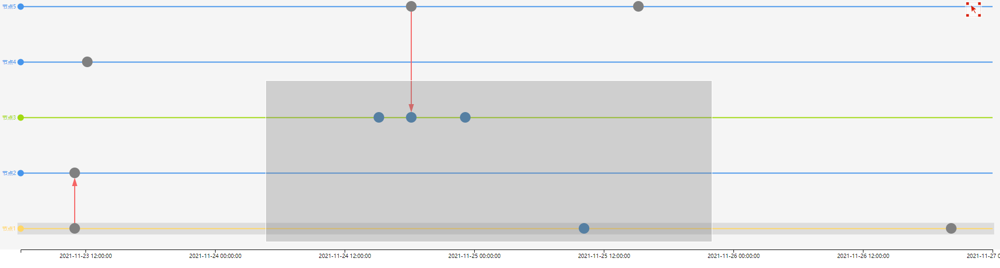

# graph-timeline
是一个用于图分析中分析节点的时间关系的组件<br />
关于组件的业务场景及介绍请看[这里](./Component.md)

## 安装
````
npm install graph-timeline
````
## 使用示例
在线的展示案例可以看[这里](https://codesandbox.io/s/graph-timeline-example-jfi377)

example展示了和antv G6的联动使用效果，
你可以进入example目录然后运行项目查看效果

```typescript
  import NpmTimeLine from 'graph-timeline';
  function App() {
    const nodes = [
      {id: '1',name: '节点1', date: '2021-11-25 10:10:10', , color: 'red'},
      {id: '2',name: '节点1', date: '2021-11-23 11:00:10'},
      {id: '3',name: '节点1', date: '2021-11-26 20:10:10'},
      {id: '4',name: '节点2', date: '2021-11-23 11:00:10'},
      {id: '5',name: '节点3', date: '2021-11-24 18:10:10'},
      {id: '6',name: '节点3', date: '2021-11-24 15:10:10'},
      {id: '7',name: '节点3', date: '2021-11-24 23:10:10'},
      {id: '8',name: '节点4', date: '2021-11-23 12:10:10'},
      {id: '9',name: '节点5', date: '2021-11-25 15:12:10'},
      {id: '10',name: '节点5', date: '2021-11-24 18:10:10'},
    ];
    const links = [
      {source: '2', target: '4'},
      {source: '2', target: '4'},
    ];
    return (
      <>
        <NpmTimeLine
          height={500}
          nodes={nodes}
          links={links}
          usBrush
          selectedItem={['节点1']}
          onBrushChange={ (value) => {console.log(value)}}
          // timeLabelFormat={ (date) => date.toLocaleDateString()}
          onSelect={(selectedData, show, d) => {console.log(selectedData, d, show)}}
          onSelectedNodesChange={
            (current, selectedData) => {
              console.log(`当前选中数据：${JSON.stringify(current)}, 已选中数据：${JSON.stringify(selectedData)}`)
            }
          }
          options={{
            colors: {
              '节点1': '#ffd666',
              '节点3': '#a0d911'
            },
            node: {
              size: 10
            }
          }}
          // options={{
          //   background: '#234dad',
          //   xAxis: {
          //     color: 'red',
          //     tickColor: 'red',
          //     axisColor: 'red'
          //   },
          //   node: {
          //     color: 'blue',
          //     size: 10
          //   },
          //   arrowColor: 'blue'
          // }}
        />
      </>
    );
  }
```


**可以进行时间拖拽和缩放。点击右上角图标可以切换拖拽和缩放，点击左侧文字可以选中当前行**

## 配置项Props
* width?: number | '100%'
> 宽度，默认100%
* height?: number
> 高度，默认300px
* padding?: [number, number, number, number]
> 内边距，值为长度为4的数据，分别对应上、右、下、左。默认值[20, 20, 20, 50]
* nodes: []
> 配置节点对应的数据，数组中的对象`id`、`name`、`date`属性是必须的, `color`属性可以调整事件节点颜色
* links: []
> 配置节点之间的连接关系，其中`source`和`target`均对应nodes中的节点id。
* useBrush?: boolean
> 配置是否启用框选功能，默认为`true`。如果启用则会展示框选按钮
* selectedItem?: string[]
> 配置初始选中的节点，如果有值，则y轴对应的节点会选中
* timeLabelFormat?: (date: Date) => string
> 对x轴的时间展示文本进行格式化，接收一个Date作为参数，返回值为字符串
* onBrushChange?: (value: []) => void;
> 框选的回调函数，参数是被框选的节点的信息。
* onSelect?: <T>(d: T, show: boolean, selectedData: T[]) => void;
> 点击y轴选中某一行的回调函数。
* onSelectedNodesChange?: <T>(d: T, show: boolean, selectedData: T[]) => void;
> 节点选中变化事件，按住alt键可以多选
* onSelectedLinksChange?: <T>(current: T | null, selectedNodes: T[]) => void;
> 节点选中变化事件，按住alt键可以多选
* options?: {}
> 图标样式设置
```
  options:{
    background: '#234dad',        // 整体的背景颜色
    colors: string[] | Record<string, string>,             // 根据该色板循环设置y轴每个item的颜色，如果是对象则根据nodes数据中的name属性进行获取
    xAxis: {
      color: 'red',               // x轴的文本颜色
      tickColor: 'red',           // x轴的分割线颜色
      axisColor: 'red'            // x轴的轴线颜色
    },
    node: {                
      color: 'blue',              // 节点颜色
      size: 10,                   // 节点的大小
      selectedColor: '#148EF4'    // 选中节点的颜色
    },
    link: {
      color: '#148EF4',           // 边的颜色
      selectedColor: '#148EF4'    // 选中边的颜色
    }
  }
```
## 功能列表

###功能描述
* 节点颜色控制
背景
  
在进行时间线展示分析的时候，节点类别是较为重要的一个数据维度。这个类别可以指网络中节点的类别，通过社区发现给出的节点社区标签，或者业务人员自定义的不同节点类别等。节点类别可以通过节点颜色进行展示与区分。这个功能涉及节点颜色、节点标签颜色、节点时间线颜色、事件边颜色、事件起点终点颜色，需要进行统筹考虑。
  
方案
  
  基于当前情况，考虑分阶段实现
  
第一阶段：节点、节点标签、节点时间线统一颜色，支持按照节点分组进行涂色。如果仅给出节点分组，则组件按照分组以及默认色板涂色。也支持给出节点分组与颜色，组件进行涂色。事件起点、重点、边的颜色默认统一颜色。

第二阶段：事件起点颜色与边颜色可以分组定义。详情待讨论

第三阶段：事件边颜色支持两色渐变。详情待讨论。

## 变更日志
### v1.0.2
* 增加了`useBrush`选项，用于切换是否使用框选功能
* 增加了`timeLabelFormat`选项，可以用于自定义x轴的label展示
* readme文件修改
### v1.0.3
* 修改了缩放时节点及连线超出轴线范围的情况
* y轴节点及横线样式修改，去除了轴线展示
* 去除了y轴的配置项
* readme文件修改

### v1.0.4
* 修改了y轴样式修改的代码，减少了入参
* y轴增加了点击事件，可以点击文本选中当前行
* 增加了y轴点击事件的回调函数
* 增加了纵向的滚动条，当分类变多时展示可以更美观
* 修改了缩放时x轴展示的问题

### v1.0.5
* 将选中当前行变为多选，回调函数参数增加已选数据
* 框选按钮调整到右上方，样式优化

### v1.0.6
* 增加了colors色板参数，可以控制横向线条及文本的颜色循环
* 节点数据对象中可以增加color属性，用来单点控制某一项的颜色
* 修改了nodes参数的处理方式。这个需要额外说明：之前只有在id一致的时候节点才可能出现在同一行，但是这个很明显不符合实际的使用情况，一个节点很可能存在于多个时间点，如果id一致的话那么这些一行的节点将无法区分（只能通过时间区分，但是也有对应的问题），现在修改为id作为所有节点的唯一标识，通过name来判断是否是同一节点的不同时刻。
* 修改了tooltip的展示，将以前的展示id更改为展示name
* readme文件修改

### v1.0.7
* 增加了参数tooltip，用于控制tooltip展示以及自定义内容
* 修改了生成的元素的id，使其更句有标识性，避免与其他库冲突

### v1.0.8 & v1.0.9
* 解决了箭头反向时的展示异常[issue#9](https://github.com/hyqaimx/graph-timeline/issues/9)
* 箭头展示大小优化，根据节点大小动态变化
* 缩放时箭头展示，x轴样式调整

### v1.1.0
* 增加了节点的选中事件，按住alt键可以多选
* 增加了初始化是默认选中的节点，注意，这个是针对y轴的选项，也就是对应到实际分析图中的节点
* 从这个版本开始要逐渐考虑实际使用中涉及的交互，我认为这是一个较大的版本变动，所以加到1.1.0版本

### v1.1.1
* 增加了边的选中事件，按住alt键可以多选
* 修改了原有的节点及边的在选中和未选中的样式
* 优化了在点击画布时一直触发边和节点的选中变化事件

### v1.1.2
* 增加与antv G6使用的案例
* 修改了动态修改选择点时无法渲染视图的问题

### v1.1.3 & v1.1.4
* 修改了example中的使用案例
* 增加了自定义设置节点颜色的功能，事件节点与节点颜色保持一致，也可通过nodes进行单独定制

### v1.1.5
* 解决了切换框选时视图刷新导致的框选范围不准确的问题

### v1.1.6
* 我们经过讨论后，决定对data的数据格式进行调整，主要是考虑到存在节点的ID不一样但是label相同的情况，这种情况下无法通过单独的name进行分组
* 解决了当出现竖向滚动条时同时会出现横向滚动条的问题

### v1.1.7
* 解决了在和antv/g6组件进行联动时出现的交互问题
* 增加了局部更新的能力
* 优化了滚动条的问题

## 题外话
这个组件是从部门内部的需求衍生出来的一个组件，起初只是为了满足业务需求。
由于所在部门的调整，现在这个组件被叫停了，我也只能在原来的基础上进行一些功能的优化。
非常感谢我们的产品**大黄蜂**，提出很多的指导和建议，对组件功能的推进有很大的帮助。
目前的组件基本已经完善，保证了基础的使用，但是有很多的功能还没有实现（比如缩放热力图），一方面是功能实现比较复杂，另一方面的话也没有太多的精力去专门开发。但是我内心也不想放弃这个我认为很不错的组件。
在和产品大大协商之后，我们决定发起一个赞助，如果赞助超`2000`的话我们就一起继续推进这个项目。也希望各位可以多多支持。
<div align="center"></div>

### 目前已获得的赞助: `115`
非常感谢以下用户的赞助(仅展示微信名称)：
* null
* 海连天
* Nelis
* 大鱼

  
