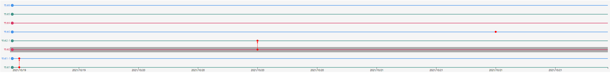

# graph-timeline
是一个用于图分析中分析节点的时间关系的组件

## 使用示例
```typescript
  import NpmTimeLine from 'graph-timeline';
  function App() {
    const nodes = [
      {id: '1', name: '节点1', date: '2021-10-19 12:00:00'},
      {id: '1-1', name: '节点1-1', date: '2021-10-19 12:00:00'},
      {id: '2', name: '节点2', date: '2021-10-20 12:00:00'},
      {id: '2-1', name: '节点2-1', date: '2021-10-20 12:00:00'},
      {id: '3', name: '节点3', date: '2021-10-21 12:00:00'},
      {id: '4', name: '节点4', date: '2021-10-22 12:00:00'},
      {id: '5', name: '节点5', date: '2021-10-23 12:00:00'},
      {id: '6', name: '节点6', date: '2021-10-24 12:00:00'},
    ];
    const links = [
      {source: '1', target: "1-1"},
      {source: '2', target: "2-1"},
    ];
    return (
      <>
        <NpmTimeLine
          nodes={nodes}
          links={links}
          onBrushChange={ (value) => {console.log(value)}}
          // options={{
          //   background: '#234dad',
          //   xAxis: {
          //     color: 'red',
          //     tickColor: 'red',
          //     axisColor: 'red'
          //   },
          //   yAxis: {
          //     color: 'red',
          //     tickColor: 'red',
          //     axisColor: 'red'
          //   },
          //   node: {
          //     color: 'blue',
          //     size: 10
          //   },
          //   arrowColor: 'blue'
          // }}
        />
      </>
    );
  }
```

**可以进行时间拖拽和缩放。点击框选可以选择节点**

## 配置项Props
* width?: number | '100%'
> 宽度，默认100%
* height?: number
> 高度，默认300px
* padding?: [number, number, number, number]
> 内边距，值为长度为4的数据，分别对应上、右、下、左。默认值[20, 20, 20, 50]
* nodes: []
> 配置节点对应的数据，数组中的对象`id`、`name`、`date`属性是必须的
* links: []
> 配置节点之间的连接关系，其中`source`和`target`均对应nodes中的节点id。
* useBrush?: boolean
> 配置是否启用框选功能，默认为`true`。如果启用则会展示框选按钮
* timeLabelFormat?: (date: Date) => string
> 对x轴的时间展示文本进行格式化，接收一个Date作为参数，返回值为字符串
* onBrushChange?: (value: []) => void;
> 框选的回调函数，参数是被框选的节点的信息。
* options?: {}
> 图标样式设置
```
  options:{
    background: '#234dad', // 整体的背景颜色
    xAxis: {
      color: 'red',        // x轴的文本颜色
      tickColor: 'red',    // x轴的分割线颜色
      axisColor: 'red'     // x轴的轴线颜色
    },
    node: {                
      color: 'blue',       // 节点颜色
      size: 10             // 节点的大小
    },
    arrowColor: 'blue'     // 连线的颜色
  }
```
## 变更日志
### v1.0.2
* 增加了`useBrush`选项，用于切换是否使用框选功能
* 增加了`timeLabelFormat`选项，可以用于自定义x轴的label展示
* readme文件修改
### v1.0.3
* 修改了缩放时节点及连线超出轴线范围的情况
* y轴节点及横线样式修改，去除了轴线展示
* 去除了y轴的配置项
* readme文件修改